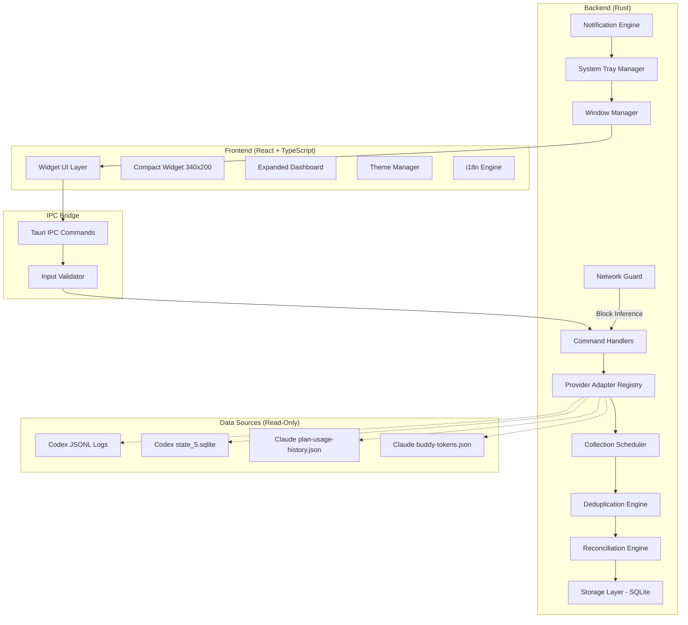
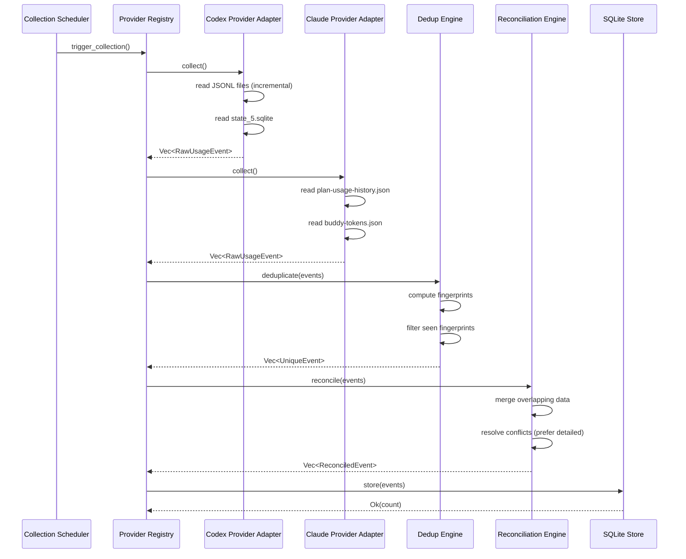
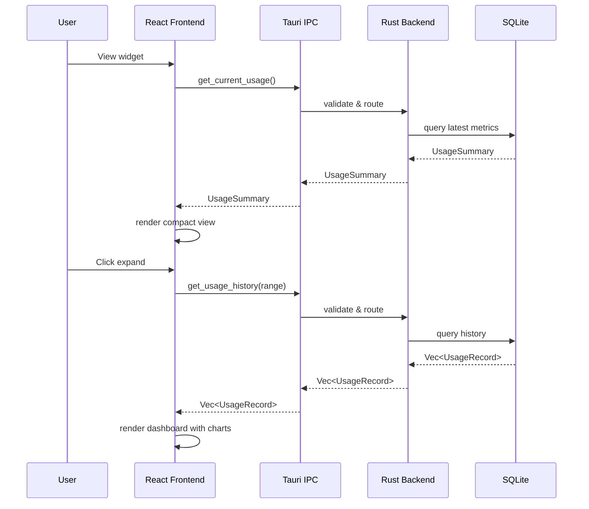
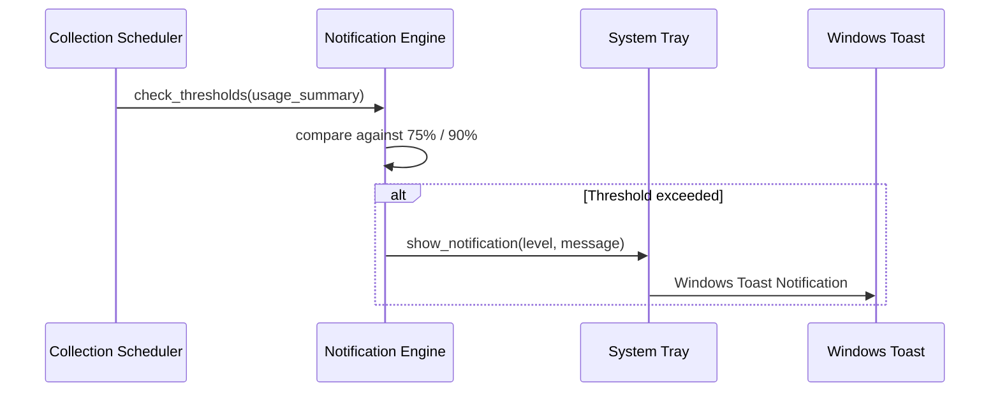

# Design Document: AI Usage Widget

## Overview

The AI Usage Widget is a Windows 11 Desktop Widget built with Tauri 2, React, TypeScript, and Rust that passively tracks token usage, quota consumption, context window utilization, and usage history from AI applications (Codex Desktop and Claude Desktop). The widget operates under a strict zero-token guarantee — collecting data must never generate model inference requests.

The system reads local data sources (JSONL session logs, SQLite databases, JSON files) to aggregate usage metrics and presents them in a compact always-on-top widget (340×200px) with an expandable dashboard view. It uses a Provider Adapter pattern for extensibility, stores historical data in a local SQLite database with 1-year retention, and integrates with Windows 11 features (system tray, autostart, DPI scaling, glass appearance).

## Architecture

### System Architecture Overview



### Layer Separation

| Layer           | Technology         | Responsibility                                       |
| --------------- | ------------------ | ---------------------------------------------------- |
| Presentation    | React + TypeScript | UI rendering, user interaction, theming              |
| IPC Bridge      | Tauri Commands     | Validated communication between frontend and backend |
| Application     | Rust               | Business logic, scheduling, orchestration            |
| Data Collection | Rust               | File reading, parsing, watching                      |
| Storage         | Rust + SQLite      | Persistence, querying, retention                     |
| Platform        | Rust + Tauri       | Windows integration, tray, notifications             |

## Sequence Diagrams

### Data Collection Flow



### Widget Interaction Flow



### Notification Flow



## Components and Interfaces

### Component 1: Provider Adapter Interface

**Purpose**: Abstract data collection from different AI applications behind a uniform interface. Enables adding new providers without modifying core logic.

**Interface**:

```rust
/// Core trait that all provider adapters must implement
pub trait ProviderAdapter: Send + Sync {
    /// Unique identifier for this provider (e.g., "codex", "claude")
    fn provider_id(&self) -> &str;

    /// Human-readable display name
    fn display_name(&self) -> &str;

    /// Check if this provider's data sources are available
    fn is_available(&self) -> bool;

    /// Collect raw usage events since the given checkpoint
    fn collect(&self, since: Option<DateTime<Utc>>) -> Result<CollectionResult, CollectionError>;

    /// Get current real-time usage summary (for widget display)
    fn get_current_summary(&self) -> Result<ProviderSummary, CollectionError>;

    /// Get the last successful collection timestamp
    fn last_checkpoint(&self) -> Option<DateTime<Utc>>;
}

pub struct CollectionResult {
    pub events: Vec<RawUsageEvent>,
    pub checkpoint: DateTime<Utc>,
    pub source_metadata: SourceMetadata,
}

pub struct SourceMetadata {
    pub files_read: u32,
    pub bytes_processed: u64,
    pub errors: Vec<CollectionWarning>,
}
```

**Responsibilities**:

- Encapsulate all knowledge about a specific AI application's data format
- Handle incremental reads (only process new data since last checkpoint)
- Return normalized usage events regardless of source format
- Report availability and errors without crashing the system

### Component 2: Codex Provider Adapter

**Purpose**: Read and parse Codex Desktop's JSONL session logs and SQLite database to extract token usage events.

**Interface**:

```rust
pub struct CodexAdapter {
    sessions_dir: PathBuf,       // ~/.codex/sessions/
    state_db_path: PathBuf,      // ~/.codex/state_5.sqlite
    last_processed: Option<DateTime<Utc>>,
    file_positions: HashMap<PathBuf, u64>,  // Track read position per file
}

impl CodexAdapter {
    pub fn new(config: CodexConfig) -> Result<Self, ConfigError>;

    /// Parse a single JSONL file from a byte offset
    fn parse_jsonl_file(&self, path: &Path, offset: u64) -> Result<Vec<RawUsageEvent>, ParseError>;

    /// Extract token_count events from JSONL entries
    fn extract_token_events(&self, entries: &[JsonlEntry]) -> Vec<RawUsageEvent>;

    /// Read thread summaries from state_5.sqlite
    fn read_thread_summaries(&self, since: Option<DateTime<Utc>>) -> Result<Vec<RawUsageEvent>, DbError>;
}
```

**Responsibilities**:

- Discover JSONL files in `~/.codex/sessions/YYYY/MM/DD/` directory structure
- Incrementally read JSONL files from last known position
- Parse `token_count` events extracting: `input_tokens`, `cached_input_tokens`, `output_tokens`, `reasoning_output_tokens`, `total_tokens`, `model_context_window`
- Parse `session_meta` events for model information
- Read `state_5.sqlite` threads table for summary reconciliation
- Generate stable fingerprints for deduplication

### Component 3: Claude Provider Adapter

**Purpose**: Read Claude Desktop's local JSON files to extract percentage-based usage and daily token counts.

**Interface**:

```rust
pub struct ClaudeAdapter {
    data_dir: PathBuf,    // %LOCALAPPDATA%\Packages\Claude_pzs8sxrjxfjjc\LocalCache\Roaming\Claude\
    last_sample_time: Option<i64>,  // Last processed sample timestamp (ms)
}

impl ClaudeAdapter {
    pub fn new(config: ClaudeConfig) -> Result<Self, ConfigError>;

    /// Parse plan-usage-history.json for quota percentage samples
    fn parse_usage_history(&self, since: Option<i64>) -> Result<Vec<QuotaSample>, ParseError>;

    /// Parse buddy-tokens.json for daily token count
    fn read_daily_tokens(&self) -> Result<DailyTokenCount, ParseError>;
}

pub struct QuotaSample {
    pub timestamp_ms: i64,
    pub org_id: String,
    pub fast_hours_pct: f64,    // fh field
    pub standard_pct: f64,      // sd field
    pub excess_pct: f64,        // xu field
}

pub struct DailyTokenCount {
    pub date: NaiveDate,
    pub tokens: u64,
}
```

**Responsibilities**:

- Read `plan-usage-history.json` parsing version 2 schema
- Extract quota percentage samples (fast hours, standard, excess)
- Read `buddy-tokens.json` for daily token aggregates
- Handle Windows Store sandboxed paths
- Hash `org_id` for privacy before storage

### Component 4: Deduplication Engine

**Purpose**: Prevent duplicate events from being stored when the same data is read multiple times.

**Interface**:

```rust
pub struct DeduplicationEngine {
    seen_fingerprints: BloomFilter,  // In-memory probabilistic filter
    db: Arc<SqlitePool>,             // For definitive checks
}

impl DeduplicationEngine {
    /// Compute a stable fingerprint for an event
    pub fn fingerprint(event: &RawUsageEvent) -> EventFingerprint;

    /// Filter out events that have already been seen
    pub fn deduplicate(&self, events: Vec<RawUsageEvent>) -> Vec<RawUsageEvent>;

    /// Mark events as seen after successful storage
    pub fn mark_seen(&mut self, fingerprints: &[EventFingerprint]);
}

/// Fingerprint = SHA-256(provider_id + timestamp + model + token_counts)
pub struct EventFingerprint([u8; 32]);
```

**Responsibilities**:

- Compute deterministic fingerprints from event content (not insertion order)
- Use Bloom filter for fast in-memory rejection of known duplicates
- Fall back to SQLite check for Bloom filter positives
- Support fingerprint schema versioning for future-proofing

### Component 5: Storage Layer

**Purpose**: Persist usage events and provide efficient querying for the UI.

**Interface**:

```rust
pub struct StorageLayer {
    pool: SqlitePool,
    retention_days: u32,  // Default: 365
}

impl StorageLayer {
    pub async fn store_events(&self, events: &[ReconciledEvent]) -> Result<u32, StorageError>;
    pub async fn get_current_summary(&self) -> Result<UsageSummary, StorageError>;
    pub async fn get_history(&self, range: TimeRange, granularity: Granularity) -> Result<Vec<UsageRecord>, StorageError>;
    pub async fn get_provider_summary(&self, provider_id: &str) -> Result<ProviderSummary, StorageError>;
    pub async fn prune_expired(&self) -> Result<u32, StorageError>;
    pub async fn backup(&self, dest: &Path) -> Result<(), StorageError>;
    pub async fn restore(&self, src: &Path) -> Result<(), StorageError>;
    pub async fn get_collection_stats(&self) -> Result<CollectionStats, StorageError>;
}

pub enum Granularity {
    Hourly,
    Daily,
    Weekly,
    Monthly,
}
```

**Responsibilities**:

- CRUD operations for usage events
- Aggregation queries (sum, avg by time period)
- Retention enforcement (prune records older than 1 year)
- Backup/Restore/Rollback support
- Database migration management

### Component 6: Network Guard

**Purpose**: Enforce the zero-token guarantee by blocking outbound requests to model inference endpoints.

**Interface**:

```rust
pub struct NetworkGuard {
    allowed_hosts: HashSet<String>,
    blocked_patterns: Vec<Regex>,
}

impl NetworkGuard {
    pub fn new(config: NetworkConfig) -> Self;

    /// Check if a URL is allowed
    pub fn is_allowed(&self, url: &str) -> bool;

    /// Get the Tauri allowlist configuration
    pub fn to_tauri_allowlist(&self) -> TauriAllowlist;
}

// Allowed: GitHub API (update checks only)
// Blocked: api.openai.com/v1/chat/completions, api.anthropic.com/v1/messages, etc.
```

**Responsibilities**:

- Define outbound network allowlist (only GitHub API for update checks)
- Block all known model inference endpoints
- Integrate with Tauri's permission system
- Log any blocked requests for audit

### Component 7: Window Manager

**Purpose**: Handle widget positioning, always-on-top, click-through mode, DPI scaling, and multi-monitor support.

**Interface**:

```rust
pub struct WindowManager {
    compact_window: Option<Window>,
    dashboard_window: Option<Window>,
    config: WindowConfig,
}

impl WindowManager {
    pub fn create_compact_widget(&mut self) -> Result<(), WindowError>;
    pub fn toggle_dashboard(&mut self) -> Result<(), WindowError>;
    pub fn set_always_on_top(&self, enabled: bool) -> Result<(), WindowError>;
    pub fn set_click_through(&self, enabled: bool) -> Result<(), WindowError>;
    pub fn handle_fullscreen_change(&self, is_fullscreen: bool) -> Result<(), WindowError>;
    pub fn get_dpi_scale(&self) -> f64;
    pub fn handle_monitor_change(&self) -> Result<(), WindowError>;
}

pub struct WindowConfig {
    pub width: u32,           // 340
    pub height: u32,          // 200
    pub always_on_top: bool,
    pub click_through: bool,
    pub position: WindowPosition,
    pub monitor: MonitorPreference,
}
```

**Responsibilities**:

- Create and manage compact widget window (340×200px)
- Create and manage expanded dashboard window
- Implement always-on-top with auto-hide on fullscreen apps
- Implement click-through mode with Win+Shift+U recovery shortcut
- Handle DPI scaling across monitors
- Persist window position preference

### Component 8: Frontend UI (React + TypeScript)

**Purpose**: Render the compact widget and expanded dashboard with Thai/English localization and Windows 11 glass appearance.

**Interface**:

```typescript
// Core state management
interface AppState {
  view: "compact" | "dashboard";
  locale: "th" | "en";
  theme: "glass" | "solid";
  usage: UsageSummary | null;
  history: UsageRecord[];
  providers: ProviderStatus[];
  notifications: Notification[];
  isLoading: boolean;
  error: AppError | null;
}

// IPC bridge (frontend side)
interface TauriCommands {
  getCurrentUsage(): Promise<UsageSummary>;
  getUsageHistory(
    range: TimeRange,
    granularity: Granularity,
  ): Promise<UsageRecord[]>;
  getProviderStatus(): Promise<ProviderStatus[]>;
  triggerCollection(): Promise<CollectionResult>;
  getSettings(): Promise<AppSettings>;
  updateSettings(settings: Partial<AppSettings>): Promise<void>;
  backup(path: string): Promise<void>;
  restore(path: string): Promise<void>;
  checkForUpdates(): Promise<UpdateInfo | null>;
}
```

**Responsibilities**:

- Render compact widget with usage meters (token, quota, context window)
- Render expanded dashboard with charts and history
- Implement Thai (default) and English localization
- Apply Windows 11 Mica/Acrylic glass effect
- Handle DPI-aware rendering
- Communicate with backend exclusively through validated IPC commands

## Data Models

### Core Event Model

```rust
/// Raw event as collected from a provider before deduplication
#[derive(Debug, Clone, Serialize, Deserialize)]
pub struct RawUsageEvent {
    pub provider_id: String,
    pub event_type: EventType,
    pub timestamp: DateTime<Utc>,
    pub model: Option<String>,
    pub tokens: TokenUsage,
    pub context_window: Option<u64>,
    pub quota: Option<QuotaUsage>,
    pub session_hash: Option<String>,   // SHA-256 of session ID
    pub project_hash: Option<String>,   // SHA-256 of project path
    pub source_file: Option<String>,    // Which file this came from
    pub raw_metadata: Option<serde_json::Value>,
}

#[derive(Debug, Clone, Serialize, Deserialize)]
pub struct TokenUsage {
    pub input_tokens: Option<u64>,
    pub cached_input_tokens: Option<u64>,
    pub output_tokens: Option<u64>,
    pub reasoning_tokens: Option<u64>,
    pub total_tokens: Option<u64>,
}

#[derive(Debug, Clone, Serialize, Deserialize)]
pub struct QuotaUsage {
    pub fast_hours_pct: Option<f64>,
    pub standard_pct: Option<f64>,
    pub excess_pct: Option<f64>,
    pub daily_tokens: Option<u64>,
}
```

```rust
#[derive(Debug, Clone, Serialize, Deserialize)]
pub enum EventType {
    TokenCount,      // Per-turn token usage from Codex JSONL
    SessionSummary,  // Thread-level summary from Codex SQLite
    QuotaSample,     // Periodic quota snapshot from Claude
    DailyAggregate,  // Daily token total from Claude buddy-tokens
}

/// Reconciled event ready for storage
#[derive(Debug, Clone, Serialize, Deserialize)]
pub struct ReconciledEvent {
    pub id: Uuid,
    pub fingerprint: EventFingerprint,
    pub provider_id: String,
    pub event_type: EventType,
    pub timestamp: DateTime<Utc>,
    pub model: Option<String>,
    pub tokens: TokenUsage,
    pub context_window: Option<u64>,
    pub quota: Option<QuotaUsage>,
    pub session_hash: Option<String>,
    pub project_hash: Option<String>,
    pub reconciled_at: DateTime<Utc>,
    pub source_count: u8,  // How many sources contributed to this event
}
```

### SQLite Schema

```sql
-- Core usage events table
CREATE TABLE usage_events (
    id TEXT PRIMARY KEY,              -- UUID v7 (time-ordered)
    fingerprint BLOB NOT NULL,        -- SHA-256 fingerprint (32 bytes)
    provider_id TEXT NOT NULL,        -- 'codex' | 'claude'
    event_type TEXT NOT NULL,         -- enum as string
    timestamp_utc TEXT NOT NULL,      -- ISO 8601 UTC
    model TEXT,                       -- model identifier
    input_tokens INTEGER,
    cached_input_tokens INTEGER,
    output_tokens INTEGER,
    reasoning_tokens INTEGER,
    total_tokens INTEGER,
    context_window INTEGER,
    quota_fast_pct REAL,
    quota_standard_pct REAL,
    quota_excess_pct REAL,
    quota_daily_tokens INTEGER,
    session_hash TEXT,                -- SHA-256 of session ID
    project_hash TEXT,                -- SHA-256 of project path
    source_count INTEGER DEFAULT 1,
    reconciled_at TEXT NOT NULL,      -- ISO 8601 UTC
    created_at TEXT NOT NULL DEFAULT (datetime('now'))
);
```

```sql
-- Indexes for common queries
CREATE INDEX idx_events_provider_time ON usage_events(provider_id, timestamp_utc);
CREATE INDEX idx_events_timestamp ON usage_events(timestamp_utc);
CREATE INDEX idx_events_fingerprint ON usage_events(fingerprint);
CREATE INDEX idx_events_model ON usage_events(model);

-- Deduplication fingerprint registry
CREATE TABLE seen_fingerprints (
    fingerprint BLOB PRIMARY KEY,
    first_seen_at TEXT NOT NULL DEFAULT (datetime('now'))
);

-- Collection state tracking
CREATE TABLE collection_checkpoints (
    provider_id TEXT PRIMARY KEY,
    last_checkpoint TEXT NOT NULL,   -- ISO 8601 UTC
    last_success_at TEXT NOT NULL,
    files_processed INTEGER DEFAULT 0,
    events_collected INTEGER DEFAULT 0,
    errors_count INTEGER DEFAULT 0,
    metadata TEXT                    -- JSON for provider-specific state
);

-- File read positions for incremental processing
CREATE TABLE file_positions (
    provider_id TEXT NOT NULL,
    file_path TEXT NOT NULL,
    byte_offset INTEGER NOT NULL DEFAULT 0,
    last_read_at TEXT NOT NULL,
    PRIMARY KEY (provider_id, file_path)
);

-- Application settings
CREATE TABLE settings (
    key TEXT PRIMARY KEY,
    value TEXT NOT NULL,
    updated_at TEXT NOT NULL DEFAULT (datetime('now'))
);

-- Backup history for rollback support
CREATE TABLE backup_history (
    id TEXT PRIMARY KEY,
    created_at TEXT NOT NULL,
    file_path TEXT NOT NULL,
    size_bytes INTEGER NOT NULL,
    checksum TEXT NOT NULL,         -- SHA-256 of backup file
    description TEXT
);
```

**Validation Rules**:

- `timestamp_utc` must be valid ISO 8601 and not in the future
- `provider_id` must be a registered provider
- `fingerprint` must be exactly 32 bytes
- Token values must be non-negative when present
- Quota percentages must be in range [0.0, 100.0+] (excess can exceed 100%)
- `model` when present must be non-empty string

### Frontend Data Types

```typescript
interface UsageSummary {
  providers: ProviderSummary[];
  totalTokensToday: number | null;
  totalTokensThisWeek: number | null;
  lastUpdated: string; // ISO 8601
}

interface ProviderSummary {
  providerId: string;
  displayName: string;
  isAvailable: boolean;
  currentModel: string | null;
  tokens: {
    inputToday: number | null;
    outputToday: number | null;
    totalToday: number | null;
  };
  quota: {
    fastHoursPct: number | null;
    standardPct: number | null;
    excessPct: number | null;
    dailyTokens: number | null;
  } | null;
  contextWindow: {
    size: number | null;
    utilized: number | null; // tokens used in current context
  } | null;
  lastActivity: string | null; // ISO 8601
}

interface UsageRecord {
  timestamp: string; // ISO 8601
  providerId: string;
  model: string | null;
  inputTokens: number | null;
  outputTokens: number | null;
  totalTokens: number | null;
  quotaFastPct: number | null;
  quotaStandardPct: number | null;
}

interface ProviderStatus {
  providerId: string;
  displayName: string;
  isAvailable: boolean;
  lastCollection: string | null;
  eventsCollected: number;
  errors: string[];
}
```

## Algorithmic Pseudocode

### JSONL Incremental Reader Algorithm

```rust
/// Reads new entries from a JSONL file starting from a byte offset
/// Uses seek-based reading to avoid re-processing already-seen entries
fn read_jsonl_incremental(path: &Path, offset: u64) -> Result<(Vec<JsonlEntry>, u64)> {
    let file = File::open(path)?;
    let file_size = file.metadata()?.len();

    // If file is smaller than offset, it was rotated/truncated - start fresh
    if file_size < offset {
        return read_jsonl_incremental(path, 0);
    }

    file.seek(SeekFrom::Start(offset))?;
    let reader = BufReader::new(file);
    let mut entries = Vec::new();
    let mut new_offset = offset;

    for line in reader.lines() {
        let line = line?;
        new_offset += line.len() as u64 + 1; // +1 for newline

        if line.trim().is_empty() {
            continue;
        }

        match serde_json::from_str::<JsonlEntry>(&line) {
            Ok(entry) => entries.push(entry),
            Err(e) => {
                log::warn!("Skipping malformed line in {:?}: {}", path, e);
                continue;
            }
        }
    }

    Ok((entries, new_offset))
}
```

### Deduplication Algorithm

```rust
/// Fingerprint computation: deterministic hash of event identity fields
fn compute_fingerprint(event: &RawUsageEvent) -> EventFingerprint {
    let mut hasher = Sha256::new();
    hasher.update(event.provider_id.as_bytes());
    hasher.update(event.timestamp.to_rfc3339().as_bytes());
    hasher.update(event.event_type.as_str().as_bytes());

    if let Some(ref model) = event.model {
        hasher.update(model.as_bytes());
    }

    // Include token values in fingerprint for uniqueness
    if let Some(total) = event.tokens.total_tokens {
        hasher.update(&total.to_le_bytes());
    }
    if let Some(input) = event.tokens.input_tokens {
        hasher.update(&input.to_le_bytes());
    }
    if let Some(output) = event.tokens.output_tokens {
        hasher.update(&output.to_le_bytes());
    }

    EventFingerprint(hasher.finalize().into())
}

/// Two-phase deduplication: Bloom filter (fast) then SQLite (definitive)
fn deduplicate(events: Vec<RawUsageEvent>, bloom: &BloomFilter, db: &SqlitePool) -> Vec<RawUsageEvent> {
    let mut unique = Vec::new();

    for event in events {
        let fp = compute_fingerprint(&event);

        // Phase 1: Bloom filter check (fast, may have false positives)
        if bloom.contains(&fp) {
            // Phase 2: Definitive check against SQLite
            if !db.fingerprint_exists(&fp) {
                // False positive from Bloom filter - event is actually new
                unique.push(event);
            }
            // else: truly duplicate, skip
        } else {
            // Definitely new (Bloom filters have no false negatives)
            unique.push(event);
        }
    }

    unique
}
```

### Reconciliation Algorithm

```rust
/// Reconciles overlapping data from multiple sources for the same provider.
/// Strategy: prefer more detailed event, merge complementary fields.
fn reconcile(events: Vec<RawUsageEvent>) -> Vec<ReconciledEvent> {
    // Group events by (provider, timestamp, model) within a 1-second window
    let groups = group_by_identity(events, Duration::seconds(1));

    let mut reconciled = Vec::new();

    for group in groups {
        if group.len() == 1 {
            // No conflict - convert directly
            reconciled.push(to_reconciled(group.into_iter().next().unwrap(), 1));
            continue;
        }

        // Multiple sources for same event - merge
        let merged = group.iter().fold(RawUsageEvent::default(), |acc, event| {
            RawUsageEvent {
                // Prefer non-None values; for tokens prefer the one with more detail
                tokens: merge_tokens(&acc.tokens, &event.tokens),
                context_window: event.context_window.or(acc.context_window),
                quota: merge_quota(&acc.quota, &event.quota),
                model: event.model.clone().or(acc.model),
                ..acc
            }
        });

        reconciled.push(to_reconciled(merged, group.len() as u8));
    }

    reconciled
}

/// Prefer the token set with more non-None fields
fn merge_tokens(a: &TokenUsage, b: &TokenUsage) -> TokenUsage {
    let a_count = count_some_fields(a);
    let b_count = count_some_fields(b);

    if b_count > a_count { b.clone() } else { a.clone() }
}
```

### Collection Scheduling Algorithm

```rust
/// Scheduler runs collection at configurable intervals (default: 30 seconds)
/// Uses adaptive scheduling - backs off on errors, speeds up on activity
async fn collection_loop(registry: Arc<ProviderRegistry>, store: Arc<StorageLayer>) {
    let mut interval = Duration::from_secs(30);
    let mut consecutive_errors = 0;

    loop {
        tokio::time::sleep(interval).await;

        match registry.collect_all().await {
            Ok(result) => {
                consecutive_errors = 0;

                // Adaptive: if many new events, check sooner
                if result.total_events > 50 {
                    interval = Duration::from_secs(15);
                } else {
                    interval = Duration::from_secs(30);
                }

                // Check notification thresholds
                check_thresholds(&result, &store).await;
            }
            Err(e) => {
                consecutive_errors += 1;
                log::error!("Collection error: {}", e);

                // Exponential backoff: 30s, 60s, 120s, max 300s
                interval = Duration::from_secs(
                    (30 * 2u64.pow(consecutive_errors.min(4))).min(300)
                );
            }
        }
    }
}
```

## Key Functions with Formal Specifications

### Function 1: fingerprint()

```rust
fn compute_fingerprint(event: &RawUsageEvent) -> EventFingerprint
```

**Preconditions:**

- `event` is a valid `RawUsageEvent` with non-empty `provider_id`
- `event.timestamp` is a valid UTC datetime
- `event.event_type` is a valid variant

**Postconditions:**

- Returns a 32-byte fingerprint
- Same event always produces the same fingerprint (deterministic)
- Different events produce different fingerprints (collision-resistant)
- Fingerprint does not depend on collection order or time

**Loop Invariants:** N/A (no loops)

### Function 2: deduplicate()

```rust
fn deduplicate(events: Vec<RawUsageEvent>, bloom: &BloomFilter, db: &SqlitePool) -> Vec<RawUsageEvent>
```

**Preconditions:**

- `events` is a valid vector (may be empty)
- `bloom` filter is initialized and consistent with `db` state
- `db` connection is alive

**Postconditions:**

- Returns a subset of `events` (output.len() <= events.len())
- No element in output has a fingerprint that exists in `db`
- All elements from `events` that are NOT in `db` are included in output
- Output preserves input ordering

**Loop Invariants:**

- For each processed event: it is included in output IFF its fingerprint is not in the database

### Function 3: reconcile()

```rust
fn reconcile(events: Vec<RawUsageEvent>) -> Vec<ReconciledEvent>
```

**Preconditions:**

- `events` is a valid vector of already-deduplicated events
- Events are from the same collection batch

**Postconditions:**

- output.len() <= events.len() (merging reduces count)
- Every field in output is sourced from at least one input event
- No information loss: if a field is non-None in any grouped input, it is non-None in output
- Each output event has `source_count` >= 1 reflecting merge count

**Loop Invariants:**

- All processed groups have produced exactly one `ReconciledEvent`
- Merged token values prefer the more detailed source

### Function 4: read_jsonl_incremental()

```rust
fn read_jsonl_incremental(path: &Path, offset: u64) -> Result<(Vec<JsonlEntry>, u64)>
```

**Preconditions:**

- `path` points to an existing readable file
- `offset` is a previously valid byte position (or 0 for first read)

**Postconditions:**

- If file_size < offset (file truncated/rotated): resets to offset 0 and reads all
- Returned offset equals the byte position after the last successfully read line
- All valid JSON lines between old offset and new offset are included in output
- Malformed lines are skipped with a warning (no crash)
- Output vector only contains successfully parsed entries

**Loop Invariants:**

- `new_offset` always equals the sum of bytes processed so far
- All entries in output are valid `JsonlEntry` values

### Function 5: is_allowed() (Network Guard)

```rust
fn is_allowed(&self, url: &str) -> bool
```

**Preconditions:**

- `url` is a non-empty string

**Postconditions:**

- Returns `true` only if the URL's host is in `allowed_hosts` AND does not match any `blocked_patterns`
- Returns `false` for any URL matching inference endpoint patterns
- Returns `false` for malformed URLs
- Decision is deterministic for same input

**Loop Invariants:** N/A

## Example Usage

### Rust Backend: Provider Registration and Collection

```rust
// Application startup
fn main() {
    let config = AppConfig::load_or_default();
    let store = StorageLayer::new(&config.db_path).await?;
    store.run_migrations().await?;

    // Register providers
    let mut registry = ProviderRegistry::new();

    if let Ok(codex) = CodexAdapter::new(config.codex.clone()) {
        if codex.is_available() {
            registry.register(Box::new(codex));
        }
    }

    if let Ok(claude) = ClaudeAdapter::new(config.claude.clone()) {
        if claude.is_available() {
            registry.register(Box::new(claude));
        }
    }

    // Start collection scheduler
    let registry = Arc::new(registry);
    let store = Arc::new(store);
    tokio::spawn(collection_loop(registry.clone(), store.clone()));

    // Start Tauri app
    tauri::Builder::default()
        .manage(registry)
        .manage(store)
        .invoke_handler(tauri::generate_handler![
            get_current_usage,
            get_usage_history,
            get_provider_status,
            trigger_collection,
            get_settings,
            update_settings,
            backup_data,
            restore_data,
        ])
        .system_tray(build_system_tray())
        .run(tauri::generate_context!())
        .expect("Error running application");
}
```

### TypeScript Frontend: Compact Widget Component

```typescript
// CompactWidget.tsx
import { useEffect, useState } from 'react';
import { invoke } from '@tauri-apps/api/core';
import { useTranslation } from 'react-i18next';

export function CompactWidget() {
  const { t } = useTranslation();
  const [usage, setUsage] = useState<UsageSummary | null>(null);
  const [error, setError] = useState<string | null>(null);

  useEffect(() => {
    const fetchUsage = async () => {
      try {
        const data = await invoke<UsageSummary>('get_current_usage');
        setUsage(data);
        setError(null);
      } catch (e) {
        setError(t('errors.fetchFailed'));
      }
    };

    fetchUsage();
    const interval = setInterval(fetchUsage, 10_000); // Refresh every 10s
    return () => clearInterval(interval);
  }, []);

  if (!usage) return <LoadingSkeleton />;

  return (
    <div className="compact-widget glass-effect">
      <header className="widget-header">
        <h1>{t('widget.title')}</h1>
        <StatusDot isConnected={usage.providers.some(p => p.isAvailable)} />
      </header>

      {usage.providers.map(provider => (
        <ProviderMeter
          key={provider.providerId}
          provider={provider}
          showNotAvailable={!provider.isAvailable}
        />
      ))}

      <footer className="widget-footer">
        <span>{t('widget.lastUpdated', { time: formatRelative(usage.lastUpdated) })}</span>
      </footer>
    </div>
  );
}
```

### IPC Command Implementation (Rust side)

```rust
#[tauri::command]
async fn get_current_usage(
    registry: State<'_, Arc<ProviderRegistry>>,
    store: State<'_, Arc<StorageLayer>>,
) -> Result<UsageSummary, String> {
    let providers = registry.get_all_summaries().await
        .map_err(|e| format!("Collection error: {}", e))?;

    let today_total = store.get_tokens_today().await
        .map_err(|e| format!("Query error: {}", e))?;

    let week_total = store.get_tokens_this_week().await
        .map_err(|e| format!("Query error: {}", e))?;

    Ok(UsageSummary {
        providers,
        total_tokens_today: today_total,
        total_tokens_this_week: week_total,
        last_updated: Utc::now().to_rfc3339(),
    })
}

#[tauri::command]
async fn get_usage_history(
    range: TimeRange,
    granularity: Granularity,
    store: State<'_, Arc<StorageLayer>>,
) -> Result<Vec<UsageRecord>, String> {
    // Validate input
    if range.start >= range.end {
        return Err("Invalid time range: start must be before end".into());
    }
    if range.duration() > Duration::days(366) {
        return Err("Time range exceeds maximum of 366 days".into());
    }

    store.get_history(range, granularity).await
        .map_err(|e| format!("Query error: {}", e))
}
```

## Error Handling

### Error Scenario 1: Provider Data Source Unavailable

**Condition**: AI application not installed, or data files moved/deleted
**Response**: Mark provider as `isAvailable: false`, display "Not available" in UI (never show 0)
**Recovery**: Re-check availability on next collection cycle; provider auto-enables when data reappears

### Error Scenario 2: Malformed JSONL Entry

**Condition**: A line in Codex JSONL log contains invalid JSON or unexpected schema
**Response**: Skip the line, log a warning with file path and line content summary, continue processing
**Recovery**: Increment `errors_count` in checkpoint; if error rate > 50% for a file, skip file and alert user

### Error Scenario 3: Database Locked

**Condition**: Codex's `state_5.sqlite` is locked by the Codex application
**Response**: Retry with exponential backoff (100ms, 200ms, 400ms, max 3 attempts), fall back to JSONL-only data
**Recovery**: Next collection cycle will retry; JSONL data provides sufficient coverage

### Error Scenario 4: File Truncated/Rotated

**Condition**: A JSONL file's size is smaller than the stored byte offset
**Response**: Reset offset to 0, re-read entire file, deduplicate against stored fingerprints
**Recovery**: Automatic via deduplication - no duplicate storage even after full re-read

### Error Scenario 5: Disk Full / Write Error

**Condition**: SQLite write fails due to disk space
**Response**: Log error, show notification to user, continue collection in memory-only mode
**Recovery**: Retry writes on next cycle; prune old data if possible; suggest backup cleanup

### Error Scenario 6: Claude Sandboxed Path Permission Denied

**Condition**: Cannot read Claude's Windows Store sandboxed data directory
**Response**: Mark Claude provider as unavailable, log detailed error with path attempted
**Recovery**: Guide user to check permissions; provide manual path configuration option

## Security Architecture

### Zero-Token Guarantee Enforcement

The system enforces zero-token operation at multiple layers:

1. **Network Layer (Tauri Permissions)**:
   - Allowlist: `api.github.com` (update checks only)
   - Block all: `api.openai.com`, `api.anthropic.com`, `*.openai.com`, `*.anthropic.com`
   - No HTTP client in frontend JavaScript context

2. **Code Layer**:
   - No AI SDK dependencies in Cargo.toml or package.json
   - All data collection reads local files only (filesystem operations)
   - No network calls in provider adapters

3. **Build Layer**:
   - CI check: grep for blocked domains in compiled output
   - Dependency audit: no packages that call inference APIs

### Tauri Permission Model

```json
{
  "permissions": {
    "fs": {
      "scope": {
        "allow": [
          "$HOME/.codex/**",
          "$LOCALAPPDATA/Packages/Claude_pzs8sxrjxfjjc/LocalCache/Roaming/Claude/**",
          "$APPDATA/ai-usage-widget/**"
        ],
        "deny": ["$HOME/.codex/**/secrets*", "$HOME/.codex/**/*.key"]
      }
    },
    "http": {
      "scope": {
        "allow": ["https://api.github.com/repos/*/releases/latest"],
        "deny": ["https://*.openai.com/**", "https://*.anthropic.com/**"]
      }
    },
    "shell": { "open": true, "execute": false },
    "window": { "all": true },
    "notification": { "all": true },
    "globalShortcut": { "all": true },
    "autostart": { "all": true },
    "tray": { "all": true }
  }
}
```

### IPC Input Validation

All Tauri commands validate inputs before processing:

```rust
/// Validate all IPC inputs at the command boundary
fn validate_time_range(range: &TimeRange) -> Result<(), ValidationError> {
    if range.start >= range.end {
        return Err(ValidationError::InvalidRange("start must be before end"));
    }
    if range.duration() > chrono::Duration::days(366) {
        return Err(ValidationError::RangeTooLarge("max 366 days"));
    }
    if range.end > Utc::now() + chrono::Duration::hours(1) {
        return Err(ValidationError::FutureDate("end cannot be in the future"));
    }
    Ok(())
}

fn validate_settings(settings: &Partial<AppSettings>) -> Result<(), ValidationError> {
    if let Some(ref locale) = settings.locale {
        if !["th", "en"].contains(&locale.as_str()) {
            return Err(ValidationError::InvalidLocale);
        }
    }
    if let Some(interval) = settings.collection_interval_secs {
        if interval < 10 || interval > 3600 {
            return Err(ValidationError::InvalidInterval("must be 10-3600 seconds"));
        }
    }
    Ok(())
}
```

### Privacy Protection

- **Project paths**: SHA-256 hashed before storage (`project_hash`)
- **Session IDs**: SHA-256 hashed before storage (`session_hash`)
- **Organization IDs**: SHA-256 hashed (Claude `org` field)
- **No prompts/responses**: Only token counts and metadata stored
- **No secrets in JS**: API keys (if future feature) stored in Rust keyring only
- **DevTools disabled**: Production builds disable Chromium DevTools

## Windows Integration

### System Tray

```rust
fn build_system_tray() -> SystemTray {
    let menu = SystemTrayMenu::new()
        .add_item("show_widget", t!("tray.show_widget"))
        .add_item("show_dashboard", t!("tray.dashboard"))
        .add_separator()
        .add_item("collect_now", t!("tray.collect_now"))
        .add_separator()
        .add_submenu("language", SystemTrayMenu::new()
            .add_item("lang_th", "ภาษาไทย")
            .add_item("lang_en", "English"))
        .add_item("settings", t!("tray.settings"))
        .add_separator()
        .add_item("quit", t!("tray.quit"));

    SystemTray::new().with_menu(menu)
}
```

### Autostart (Single Instance)

```rust
// Single instance check using named mutex
fn ensure_single_instance() -> Result<(), AppError> {
    let mutex_name = "Global\\AIUsageWidget_SingleInstance";
    match windows::Win32::System::Threading::CreateMutexW(None, true, mutex_name) {
        Ok(_) if GetLastError() == ERROR_ALREADY_EXISTS => {
            // Another instance running - activate it and exit
            send_activate_message();
            std::process::exit(0);
        }
        Ok(handle) => Ok(()),  // We got the mutex - we're the first instance
        Err(e) => Err(AppError::SingleInstance(e)),
    }
}

// Windows autostart via Registry
fn register_autostart(enabled: bool) -> Result<(), RegistryError> {
    let key = r"SOFTWARE\Microsoft\Windows\CurrentVersion\Run";
    let exe_path = std::env::current_exe()?;

    if enabled {
        registry::set_value(HKCU, key, "AIUsageWidget", exe_path.to_str()?)?;
    } else {
        registry::delete_value(HKCU, key, "AIUsageWidget")?;
    }
    Ok(())
}
```

### DPI Scaling & Multi-Monitor

```rust
fn handle_dpi_change(window: &Window, dpi: u32) {
    let scale = dpi as f64 / 96.0;
    let logical_width = 340.0;
    let logical_height = 200.0;

    window.set_size(LogicalSize::new(logical_width, logical_height));
    // WebView handles content scaling automatically via Tauri
    window.emit("dpi-changed", scale).ok();
}
```

### Click-Through Mode & Recovery

```rust
// Win+Shift+U global shortcut to toggle click-through
fn register_recovery_shortcut(app: &AppHandle) {
    app.global_shortcut_manager()
        .register("Super+Shift+U", move |_| {
            // Always disable click-through when shortcut pressed
            set_click_through(false);
            // Bring widget to focus
            show_and_focus_widget();
        })
        .expect("Failed to register recovery shortcut");
}

fn set_click_through(window: &Window, enabled: bool) {
    #[cfg(windows)]
    {
        use windows::Win32::UI::WindowsAndMessaging::*;
        let hwnd = window.hwnd().unwrap();
        let style = GetWindowLongW(hwnd, GWL_EXSTYLE);

        if enabled {
            SetWindowLongW(hwnd, GWL_EXSTYLE, style | WS_EX_TRANSPARENT | WS_EX_LAYERED);
        } else {
            SetWindowLongW(hwnd, GWL_EXSTYLE, style & !(WS_EX_TRANSPARENT | WS_EX_LAYERED));
        }
    }
}
```

### Fullscreen Auto-Hide

```rust
/// Monitor foreground window changes to detect fullscreen apps
fn start_fullscreen_monitor(window: Arc<Window>) {
    std::thread::spawn(move || {
        let mut was_hidden = false;
        loop {
            std::thread::sleep(Duration::from_secs(1));

            let is_fullscreen = detect_fullscreen_foreground();

            if is_fullscreen && !was_hidden {
                window.hide().ok();
                was_hidden = true;
            } else if !is_fullscreen && was_hidden {
                window.show().ok();
                was_hidden = false;
            }
        }
    });
}
```

## Installer & Distribution Strategy

### NSIS Installer

- Built via `tauri-bundler` with NSIS target
- Installs to `%LOCALAPPDATA%\Programs\AIUsageWidget\`
- Creates Start Menu shortcut
- Registers autostart key
- Includes uninstaller
- Signs with code signing certificate (future)

### Portable Mode

- Single `.exe` with embedded WebView2 loader
- Stores data in `./data/` relative to exe location
- Detected by presence of `portable.flag` file next to exe
- No registry modifications in portable mode

### Update Check (GitHub Releases)

```rust
async fn check_for_updates(current_version: &str) -> Result<Option<UpdateInfo>, UpdateError> {
    let url = "https://api.github.com/repos/{owner}/{repo}/releases/latest";
    let response = reqwest::get(url).await?;
    let release: GitHubRelease = response.json().await?;

    if semver::Version::parse(&release.tag_name)? > semver::Version::parse(current_version)? {
        Ok(Some(UpdateInfo {
            version: release.tag_name,
            download_url: release.assets[0].browser_download_url.clone(),
            release_notes: release.body,
            published_at: release.published_at,
        }))
    } else {
        Ok(None)
    }
}
// Note: No auto-install. Only notification + manual download link.
```

## Testing Strategy

### Unit Testing Approach

**Rust Backend (cargo test)**:

- Provider adapter parsing logic (JSONL parser, SQLite reader, JSON parser)
- Deduplication fingerprint computation and filtering
- Reconciliation merge logic
- Input validation functions
- Network guard URL checking
- Time conversion utilities

**TypeScript Frontend (vitest)**:

- Component rendering (compact widget, dashboard, meters)
- State management logic
- Localization string resolution
- Data formatting utilities (number formatting, time display)

### Property-Based Testing Approach

**Property Test Library**: `proptest` (Rust), `fast-check` (TypeScript)

Key properties to verify:

1. Fingerprint determinism: same event → same fingerprint always
2. Deduplication correctness: no duplicates pass through; no unique events lost
3. Reconciliation completeness: no information loss during merge
4. JSONL parser robustness: never crashes on arbitrary input
5. Network guard completeness: inference endpoints always blocked
6. Storage round-trip: store → query returns equivalent data
7. Time conversion: UTC ↔ Asia/Bangkok round-trips correctly

### Integration Testing Approach

- End-to-end collection pipeline with fixture JSONL/JSON files
- IPC command testing with mock data
- Window management behavior (requires Windows CI)
- System tray interaction testing

## Performance Considerations

- **JSONL Reading**: Incremental byte-offset seeking avoids re-reading entire files
- **Deduplication**: Bloom filter provides O(1) rejection for 99%+ of duplicates
- **SQLite**: WAL mode for concurrent read/write; connection pooling
- **Frontend Refresh**: 10-second UI refresh interval with change detection (avoid unnecessary re-renders)
- **Memory**: Bloom filter ~1MB for 1M fingerprints at 1% false positive rate
- **Startup**: Lazy provider initialization; widget shows cached data immediately
- **Collection**: 30-second interval balances freshness vs. disk I/O

## Dependencies

### Rust (Cargo.toml)

| Crate              | Purpose                         |
| ------------------ | ------------------------------- |
| tauri (2.x)        | Application framework           |
| serde / serde_json | Serialization                   |
| sqlx (sqlite)      | Database operations             |
| tokio              | Async runtime                   |
| chrono             | Date/time handling              |
| sha2               | Fingerprint hashing             |
| uuid (v7)          | Time-ordered IDs                |
| proptest           | Property-based testing          |
| bloom-filter       | Deduplication                   |
| semver             | Version comparison              |
| reqwest            | HTTP client (update check only) |
| windows-rs         | Win32 API bindings              |
| log / env_logger   | Logging                         |
| thiserror          | Error types                     |

### TypeScript (package.json)

| Package                 | Purpose                |
| ----------------------- | ---------------------- |
| react / react-dom       | UI framework           |
| @tauri-apps/api         | IPC bridge             |
| i18next / react-i18next | Localization           |
| recharts                | Usage charts           |
| zustand                 | State management       |
| fast-check              | Property-based testing |
| vitest                  | Test runner            |
| tailwindcss             | Styling                |
| @testing-library/react  | Component testing      |

## Correctness Properties

_A property is a characteristic or behavior that should hold true across all valid executions of a system — essentially, a formal statement about what the system should do. Properties serve as the bridge between human-readable specifications and machine-verifiable correctness guarantees._

### Property 1: Fingerprint Determinism

_For any_ valid RawUsageEvent, computing its fingerprint multiple times (at any point in time, in any order) SHALL always produce the identical 32-byte SHA-256 hash.

**Validates: Requirements 2.1, 2.5**

### Property 2: Deduplication Completeness

_For any_ set of RawUsageEvents where some events have fingerprints already stored in the database, the deduplicate function SHALL return only events whose fingerprints are NOT in the database, and SHALL include ALL events whose fingerprints are not in the database (no false rejections).

**Validates: Requirements 2.2, 2.3**

### Property 3: Reconciliation No-Information-Loss

_For any_ group of RawUsageEvents being reconciled, the resulting ReconciledEvent SHALL contain every non-None field value present in any source event, and the source_count SHALL equal the number of input events in the group. The merge SHALL prefer the token set with more non-None fields.

**Validates: Requirements 3.2, 3.3, 3.4, 3.5**

### Property 4: JSONL Incremental Reader Correctness

_For any_ valid JSONL file and any byte offset, the incremental reader SHALL: (a) return only entries that appear after the offset, (b) if file_size < offset, reset to 0 and read all entries, (c) never crash on malformed lines (skip them), and (d) return a new offset equal to the byte position after the last processed line.

**Validates: Requirements 1.3, 1.4, 1.5, 13.6**

### Property 5: Provider Error Isolation

_For any_ combination of provider states (available/unavailable/erroring), a failure in one Provider_Adapter SHALL NOT prevent other available providers from completing their collection successfully.

**Validates: Requirements 1.2, 16.1, 16.5**

### Property 6: Network Guard Completeness

_For any_ URL string, the Network Guard SHALL return true (allow) if and only if the URL's host is in the explicit allowlist AND does not match any blocked inference endpoint pattern. All inference endpoint URLs (containing openai.com or anthropic.com) SHALL be blocked, and malformed URLs SHALL be blocked.

**Validates: Requirements 5.1, 5.2, 5.5**

### Property 7: Storage Round-Trip (Backup/Restore)

_For any_ set of stored ReconciledEvents, performing backup followed by restore SHALL produce a database state equivalent to the original (all events recoverable, no data loss or corruption).

**Validates: Requirements 4.6, 4.7, 15.1, 15.3, 15.6**

### Property 8: Backup Corruption Detection

_For any_ backup file that has been modified after creation (corrupted), the restore operation SHALL reject it by detecting a SHA-256 checksum mismatch.

**Validates: Requirements 15.2, 15.4**

### Property 9: Privacy Hashing

_For any_ raw project path, session ID, or organization ID, the stored value SHALL be a valid 64-character hexadecimal SHA-256 hash that is NOT equal to the raw input value.

**Validates: Requirements 11.1, 11.2, 11.3**

### Property 10: IPC Input Validation

_For any_ invalid IPC input (time ranges where start >= end, ranges exceeding 366 days, future end dates, invalid locale codes, out-of-range intervals), the command handler SHALL reject the request with a non-empty descriptive error message.

**Validates: Requirements 11.6, 11.7**

### Property 11: Notification Threshold Accuracy

_For any_ quota percentage value, the Notification Engine SHALL trigger a warning at exactly ≥75% and a critical notification at exactly ≥90%, and SHALL NOT repeat the same threshold notification within a 1-hour cooldown window.

**Validates: Requirements 10.1, 10.2, 10.3**

### Property 12: Data Normalization

_For any_ valid Codex JSONL token_count entry or Claude plan-usage-history sample, the Provider_Adapter SHALL produce a valid RawUsageEvent with all extractable fields populated and no information loss from the source format.

**Validates: Requirements 1.7, 13.2, 14.1**

### Property 13: Timestamp Storage Consistency

_For any_ event stored in the database, the timestamp_utc field SHALL be a valid ISO 8601 UTC string, and converting it to Asia/Bangkok display time SHALL always yield UTC+7.

**Validates: Requirements 4.2, 9.4**

### Property 14: Retention Enforcement

_For any_ database state after pruning, no records with timestamp_utc older than the configured retention period (default 365 days) SHALL remain in the usage_events table.

**Validates: Requirements 4.3**

### Property 15: Exponential Backoff Correctness

_For any_ sequence of N consecutive collection errors (N ≥ 1), the next collection interval SHALL equal min(30 × 2^N, 300) seconds. Upon the first success after errors, the interval SHALL reset to 30 seconds (or 15 if many events collected).

**Validates: Requirements 16.2, 16.3**

### Property 16: Version Comparison for Updates

_For any_ pair of semantic version strings (current, latest), the update check SHALL notify the user if and only if latest > current according to semver ordering.

**Validates: Requirements 12.5**

### Property 17: Claude Checkpoint Filtering

_For any_ set of quota samples from plan-usage-history.json and a given checkpoint timestamp, the Claude_Provider_Adapter SHALL return only samples with timestamps strictly newer than the checkpoint.

**Validates: Requirements 14.4**

### Property 18: Aggregation Correctness

_For any_ set of usage events within a time range, querying with a given granularity (Hourly/Daily/Weekly/Monthly) SHALL return aggregated records whose token sums equal the sum of individual events within each time bucket.

**Validates: Requirements 4.4, 7.5**
