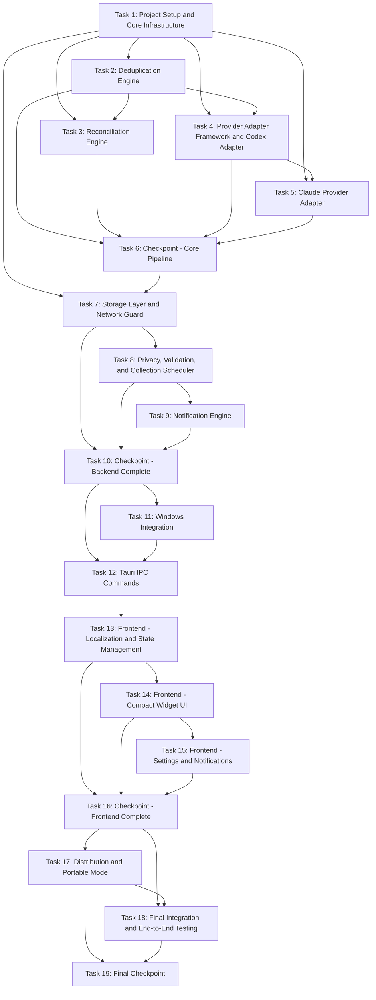

# Implementation Plan: AI Usage Widget

## Overview

Implementation follows a bottom-up approach: core data layer first (Rust), then collection pipeline, Windows integration, and finally UI layer. Each phase builds on the previous, ensuring no orphaned code. The stack is Tauri 2 + React + TypeScript + Rust + SQLite.

## Tasks

- [x] 1. Project Setup and Core Infrastructure
  - [x] 1.1 Initialize Tauri 2 project with React + TypeScript frontend and Rust backend
    - Run `npm create tauri-app` with React/TypeScript template
    - Configure Cargo.toml with required dependencies (sqlx, tokio, chrono, sha2, uuid, serde, thiserror, semver, reqwest, windows-rs, bloom)
    - Configure package.json with frontend dependencies (react, @tauri-apps/api, i18next, recharts, zustand, tailwindcss, fast-check, vitest)
    - Set up Tauri permissions in tauri.conf.json (fs scopes, http allowlist/denylist, shell, window, notification, globalShortcut, autostart, tray)
    - _Requirements: 5.1, 5.2, 5.4, 5.6_

  - [x] 1.2 Define core Rust types and error definitions
    - Create `src-tauri/src/types.rs` with RawUsageEvent, TokenUsage, QuotaUsage, EventType, ReconciledEvent, EventFingerprint structs
    - Create `src-tauri/src/error.rs` with CollectionError, StorageError, ValidationError, ParseError, ConfigError types using thiserror
    - Create `src-tauri/src/config.rs` with AppConfig, CodexConfig, ClaudeConfig, WindowConfig, NetworkConfig structs
    - _Requirements: 1.7, 4.2_

  - [x] 1.3 Set up SQLite database with migrations
    - Create migration files for usage_events, seen_fingerprints, collection_checkpoints, file_positions, settings, backup_history tables
    - Implement StorageLayer::new() with WAL mode and connection pool
    - Implement StorageLayer::run_migrations()
    - _Requirements: 4.1, 4.2_

- [x] 2. Deduplication Engine
  - [x] 2.1 Implement fingerprint computation and Bloom filter deduplication
    - Create `src-tauri/src/dedup.rs` with DeduplicationEngine struct
    - Implement compute_fingerprint() using SHA-256 of provider_id + timestamp + event_type + model + token values
    - Implement deduplicate() with two-phase Bloom filter + SQLite verification
    - Implement mark_seen() for post-storage fingerprint registration
    - _Requirements: 2.1, 2.2, 2.3, 2.4, 2.5_

  - [x] 2.2 Write property tests for fingerprint determinism
    - **Property 1: Fingerprint Determinism**
    - **Validates: Requirements 2.1, 2.5**

  - [x] 2.3 Write property tests for deduplication completeness
    - **Property 2: Deduplication Completeness**
    - **Validates: Requirements 2.2, 2.3**

- [x] 3. Reconciliation Engine
  - [x] 3.1 Implement reconciliation logic
    - Create `src-tauri/src/reconcile.rs` with ReconciliationEngine struct
    - Implement group_by_identity() to group events within 1-second window by provider_id + model
    - Implement merge_tokens() preferring the set with more non-None fields
    - Implement merge_quota() combining complementary quota data
    - Implement reconcile() producing Vec<ReconciledEvent> with source_count
    - _Requirements: 3.1, 3.2, 3.3, 3.4, 3.5_

  - [x] 3.2 Write property tests for reconciliation no-information-loss
    - **Property 3: Reconciliation No-Information-Loss**
    - **Validates: Requirements 3.2, 3.3, 3.4, 3.5**

- [x] 4. Provider Adapter Framework and Codex Adapter
  - [x] 4.1 Implement Provider Adapter trait and registry
    - Create `src-tauri/src/provider.rs` with ProviderAdapter trait definition
    - Create `src-tauri/src/registry.rs` with ProviderRegistry (register, collect_all, get_all_summaries)
    - Implement provider availability checking and error isolation
    - _Requirements: 1.1, 1.2, 16.1, 16.5_

  - [x] 4.2 Implement Codex Provider Adapter
    - Create `src-tauri/src/providers/codex.rs` with CodexAdapter struct
    - Implement JSONL file discovery (walk ~/.codex/sessions/YYYY/MM/DD/\*.jsonl)
    - Implement read_jsonl_incremental() with byte offset tracking
    - Implement parse of token_count events (input_tokens, cached_input_tokens, output_tokens, reasoning_output_tokens, total_tokens, model_context_window)
    - Implement parse of session_meta events for model identification
    - Implement SQLite reading from state_5.sqlite threads table with lock retry logic
    - Hash project paths and session IDs with SHA-256 before creating RawUsageEvent
    - _Requirements: 1.3, 1.4, 1.5, 13.1, 13.2, 13.3, 13.4, 13.5, 13.6, 11.1, 11.2_

  - [x] 4.3 Write property tests for JSONL incremental reader
    - **Property 4: JSONL Incremental Reader Correctness**
    - **Validates: Requirements 1.3, 1.4, 1.5, 13.6**

  - [x] 4.4 Write property tests for provider error isolation
    - **Property 5: Provider Error Isolation**
    - **Validates: Requirements 1.2, 16.1, 16.5**

  - [x] 4.5 Write property tests for data normalization
    - **Property 12: Data Normalization**
    - **Validates: Requirements 1.7, 13.2, 14.1**

- [x] 5. Claude Provider Adapter
  - [x] 5.1 Implement Claude Provider Adapter
    - Create `src-tauri/src/providers/claude.rs` with ClaudeAdapter struct
    - Implement parse_usage_history() for plan-usage-history.json (version 2 schema: t, org, u.fh, u.sd, u.xu)
    - Implement read_daily_tokens() for buddy-tokens.json (tokens-today.date, tokens-today.tokens)
    - Implement checkpoint-based filtering (only process samples newer than last checkpoint)
    - Handle Windows Store sandboxed path resolution
    - Hash org_id with SHA-256 before storage
    - _Requirements: 6, 14.1, 14.2, 14.3, 14.4, 14.5, 11.3_

  - [x] 5.2 Write property tests for Claude checkpoint filtering
    - **Property 17: Claude Checkpoint Filtering**
    - **Validates: Requirements 14.4**

- [x] 6. Checkpoint - Core Pipeline
  - Ensure all tests pass, ask the user if questions arise.
  - Verify: Codex adapter reads JSONL/SQLite, Claude adapter reads JSON, dedup filters duplicates, reconciliation merges correctly

- [x] 7. Storage Layer and Network Guard
  - [x] 7.1 Implement Storage Layer query and aggregation
    - Implement store_events() with batch insert
    - Implement get_current_summary() aggregating today's and this week's tokens
    - Implement get_history() with TimeRange and Granularity parameters
    - Implement prune_expired() for retention enforcement
    - Implement get_provider_summary() for per-provider stats
    - _Requirements: 4.1, 4.2, 4.3, 4.4, 4.5_

  - [x] 7.2 Implement backup, restore, and rollback
    - Implement backup() with SQLite VACUUM INTO + SHA-256 checksum
    - Implement restore() with checksum verification before applying
    - Implement rollback() to most recent valid backup
    - Maintain backup_history table records
    - _Requirements: 4.6, 4.7, 15.1, 15.2, 15.3, 15.4, 15.5, 15.6_

  - [x] 7.3 Write property tests for storage round-trip
    - **Property 7: Storage Round-Trip (Backup/Restore)**
    - **Validates: Requirements 4.6, 4.7, 15.1, 15.3, 15.6**

  - [x] 7.4 Write property tests for backup corruption detection
    - **Property 8: Backup Corruption Detection**
    - **Validates: Requirements 15.2, 15.4**

  - [x] 7.5 Write property tests for retention enforcement
    - **Property 14: Retention Enforcement**
    - **Validates: Requirements 4.3**

  - [x] 7.6 Write property tests for aggregation correctness
    - **Property 18: Aggregation Correctness**
    - **Validates: Requirements 4.4, 7.5**

  - [x] 7.7 Implement Network Guard
    - Create `src-tauri/src/network.rs` with NetworkGuard struct
    - Define allowed_hosts: ["api.github.com"]
    - Define blocked_patterns for openai.com, anthropic.com and subdomains
    - Implement is_allowed() with URL parsing and pattern matching
    - Implement to_tauri_allowlist() for config generation
    - _Requirements: 5.1, 5.2, 5.5_

  - [x] 7.8 Write property tests for network guard completeness
    - **Property 6: Network Guard Completeness**
    - **Validates: Requirements 5.1, 5.2, 5.5**

- [x] 8. Privacy, Validation, and Collection Scheduler
  - [x] 8.1 Implement privacy hashing utilities
    - Create `src-tauri/src/privacy.rs` with hash_path(), hash_session_id(), hash_org_id() functions
    - All use SHA-256 producing 64-char hex strings
    - Integrate into provider adapters (Codex hashes project/session, Claude hashes org)
    - _Requirements: 11.1, 11.2, 11.3, 11.4_

  - [x] 8.2 Write property tests for privacy hashing
    - **Property 9: Privacy Hashing**
    - **Validates: Requirements 11.1, 11.2, 11.3**

  - [x] 8.3 Implement IPC input validation
    - Create `src-tauri/src/validation.rs` with validate_time_range(), validate_settings(), validate_granularity()
    - Reject: start >= end, range > 366 days, future end dates, invalid locales, intervals outside 10-3600
    - Return descriptive error messages on rejection
    - _Requirements: 11.6, 11.7_

  - [x] 8.4 Write property tests for IPC input validation
    - **Property 10: IPC Input Validation**
    - **Validates: Requirements 11.6, 11.7**

  - [x] 8.5 Implement Collection Scheduler
    - Create `src-tauri/src/scheduler.rs` with collection_loop() async function
    - Implement configurable interval (default 30s)
    - Implement exponential backoff on errors: min(30 \* 2^N, 300) seconds
    - Implement reset to default on success
    - Implement adaptive interval (15s when >50 new events)
    - _Requirements: 1.1, 16.2, 16.3_

  - [x] 8.6 Write property tests for exponential backoff
    - **Property 15: Exponential Backoff Correctness**
    - **Validates: Requirements 16.2, 16.3**

- [x] 9. Notification Engine
  - [x] 9.1 Implement notification threshold logic
    - Create `src-tauri/src/notify.rs` with NotificationEngine struct
    - Implement check_thresholds() comparing quota against 75% and 90%
    - Implement 1-hour cooldown tracking per provider per threshold level
    - Generate Windows Toast notifications via Tauri notification API
    - Include provider name and current percentage in message
    - _Requirements: 10.1, 10.2, 10.3, 10.4_

  - [x] 9.2 Write property tests for notification threshold accuracy
    - **Property 11: Notification Threshold Accuracy**
    - **Validates: Requirements 10.1, 10.2, 10.3**

- [x] 10. Checkpoint - Backend Complete
  - Ensure all tests pass, ask the user if questions arise.
  - Verify: Full pipeline (collect → dedup → reconcile → store), notifications, network guard, validation all working

- [x] 11. Windows Integration
  - [x] 11.1 Implement Window Manager
    - Create `src-tauri/src/window.rs` with WindowManager struct
    - Implement create_compact_widget() with 340x200 logical pixels
    - Implement toggle_dashboard() for expanded view
    - Implement set_always_on_top() via Tauri window API
    - Implement DPI scaling using LogicalSize
    - Implement multi-monitor position persistence
    - _Requirements: 6.1, 8.5, 8.10_

  - [x] 11.2 Implement click-through mode and fullscreen auto-hide
    - Implement set_click_through() using Win32 WS_EX_TRANSPARENT | WS_EX_LAYERED
    - Register Win+Shift+U global shortcut to disable click-through and focus widget
    - Implement fullscreen detection loop (check foreground window state every 1s)
    - Auto-hide on fullscreen foreground, auto-show on exit
    - _Requirements: 8.6, 8.7, 8.8, 8.9_

  - [x] 11.3 Implement system tray and autostart
    - Implement build_system_tray() with context menu (show, dashboard, collect now, language, settings, quit)
    - Implement register_autostart() via Windows Registry HKCU\...\Run
    - Implement ensure_single_instance() using named Windows mutex
    - Handle second-instance activation message
    - _Requirements: 8.1, 8.2, 8.3, 8.4_

- [x] 12. Tauri IPC Commands
  - [x] 12.1 Implement all Tauri command handlers
    - Create `src-tauri/src/commands.rs` with all #[tauri::command] functions
    - get_current_usage(): query providers + storage for summary
    - get_usage_history(range, granularity): validated time range query
    - get_provider_status(): return status of all registered providers
    - trigger_collection(): manual collection trigger
    - get_settings() / update_settings(): read/write app configuration
    - backup_data(path) / restore_data(path): backup and restore operations
    - check_for_updates(): GitHub API version check
    - All commands validate input before processing
    - _Requirements: 6.2, 6.4, 7.1, 7.2, 7.3, 7.4, 7.5, 11.6, 11.7, 12.4, 12.5, 12.6_

  - [x] 12.2 Wire main.rs application startup
    - Initialize config, storage, provider registry, dedup engine, scheduler
    - Register Codex and Claude adapters (conditional on availability)
    - Spawn collection loop
    - Build Tauri app with all managed state and commands
    - Set up system tray, window manager, global shortcuts
    - Disable DevTools in production builds
    - _Requirements: 1.1, 1.2, 5.4, 8.3, 11.5_

  - [x] 12.3 Write property tests for timestamp storage consistency
    - **Property 13: Timestamp Storage Consistency**
    - **Validates: Requirements 4.2, 9.4**

  - [x] 12.4 Write property tests for version comparison
    - **Property 16: Version Comparison for Updates**
    - **Validates: Requirements 12.5**

- [x] 13. Frontend - Localization and State Management
  - [x] 13.1 Set up i18n with Thai and English translations
    - Create `src/i18n/th.json` and `src/i18n/en.json` translation files
    - Configure i18next with Thai as default locale
    - Include all UI strings: widget title, provider names, tray menu items, error messages, notification messages
    - Implement locale switching without restart
    - _Requirements: 9.1, 9.2, 9.3_

  - [x] 13.2 Implement Zustand state store and IPC bridge
    - Create `src/store/index.ts` with AppState interface
    - Implement useUsageStore with actions: fetchUsage, fetchHistory, fetchProviderStatus, triggerCollection, updateSettings
    - Create `src/lib/ipc.ts` wrapping all Tauri invoke() calls with TypeScript types
    - Implement error handling and loading states
    - _Requirements: 6.2, 6.4, 7.1_

  - [x] 13.3 Implement time formatting utilities
    - Create `src/lib/format.ts` with formatRelative(), formatTokenCount(), formatPercentage()
    - Implement UTC to Asia/Bangkok conversion for display
    - Handle null values displaying "Not available" / "ไม่มีข้อมูล"
    - _Requirements: 4.5, 6.3, 6.6, 9.4_

- [x] 14. Frontend - Compact Widget UI
  - [x] 14.1 Implement compact widget component
    - Create `src/components/CompactWidget.tsx` as the main 340x200 view
    - Implement ProviderMeter component showing token usage bars, quota percentages
    - Implement StatusDot component for provider availability
    - Implement LoadingSkeleton for initial load state
    - Apply Windows 11 glass effect CSS (backdrop-filter: blur + background transparency)
    - Implement 10-second auto-refresh with change detection
    - _Requirements: 6.1, 6.2, 6.3, 6.4, 6.5, 6.6_

  - [x] 14.2 Implement expanded dashboard component
    - Create `src/components/Dashboard.tsx` with time range selector and granularity picker
    - Implement usage chart using Recharts (line/bar chart for token usage over time)
    - Implement per-provider breakdown panels with model-level detail
    - Implement token type breakdown (input, output, reasoning, cached)
    - _Requirements: 7.1, 7.2, 7.3, 7.4, 7.5_

- [x] 15. Frontend - Settings and Notifications
  - [x] 15.1 Implement settings panel
    - Create `src/components/Settings.tsx` with controls for:
      - Collection interval slider (10-3600s)
      - Language toggle (Thai/English)
      - Notification threshold configuration
      - Autostart toggle
      - Always-on-top toggle
      - Click-through toggle
      - Backup/Restore buttons
      - Data directory path display
    - _Requirements: 8.2, 9.2, 10.1, 10.2_

  - [x] 15.2 Implement update notification UI
    - Create `src/components/UpdateBanner.tsx` showing version info and download link
    - Call check_for_updates on startup
    - Display notification without auto-installing
    - _Requirements: 12.4, 12.5, 12.6_

- [x] 16. Checkpoint - Frontend Complete
  - Ensure all tests pass, ask the user if questions arise.
  - Verify: Compact widget renders with mock data, dashboard shows charts, settings panel functional, localization works in both languages

- [x] 17. Distribution and Portable Mode
  - [x] 17.1 Configure NSIS installer and portable mode
    - Configure tauri.conf.json bundle section for NSIS target
    - Implement portable mode detection (check for portable.flag file)
    - Implement data directory resolution: portable → ./data/, installed → %APPDATA%/ai-usage-widget/
    - Skip Registry autostart in portable mode
    - _Requirements: 12.1, 12.2, 12.3_

  - [x] 17.2 Configure production build settings
    - Disable DevTools in release builds
    - Set up Tauri CSP headers
    - Configure resource embedding
    - Verify network allowlist is enforced in production bundle
    - _Requirements: 5.4, 5.6, 11.5_

- [x] 18. Final Integration and End-to-End Testing
  - [x] 18.1 Write integration tests with fixture data
    - Create fixture JSONL files mimicking real Codex session logs
    - Create fixture plan-usage-history.json and buddy-tokens.json
    - Test full pipeline: file read → parse → dedup → reconcile → store → query
    - Verify correct aggregation across providers
    - _Requirements: 1.1, 1.3, 1.7, 13.2, 14.1_

  - [x] 18.2 Write frontend component tests
    - Test CompactWidget renders provider data correctly
    - Test Dashboard displays charts with correct data
    - Test locale switching updates all text
    - Test "Not available" display for unavailable providers
    - _Requirements: 6.1, 6.2, 6.3, 7.1, 9.1, 9.2_

- [x] 19. Final Checkpoint
  - Ensure all tests pass, ask the user if questions arise.
  - Verify: NSIS installer builds, portable exe runs, full pipeline works end-to-end with real Codex/Claude data files on Windows 11

## Task Dependency Graph

```json
{
  "waves": [
    {
      "wave": 1,
      "tasks": [1],
      "description": "Project Setup and Core Infrastructure"
    },
    {
      "wave": 2,
      "tasks": [2, 3, 4, 5],
      "description": "Core Pipeline: Deduplication, Reconciliation, Provider Adapters"
    },
    {
      "wave": 3,
      "tasks": [6],
      "description": "Checkpoint - Core Pipeline"
    },
    {
      "wave": 4,
      "tasks": [7, 8, 9],
      "description": "Storage, Validation, Notifications"
    },
    {
      "wave": 5,
      "tasks": [10],
      "description": "Checkpoint - Backend Complete"
    },
    {
      "wave": 6,
      "tasks": [11, 12],
      "description": "Windows Integration and IPC Commands"
    },
    {
      "wave": 7,
      "tasks": [13, 14, 15],
      "description": "Frontend: Localization, Widget UI, Settings"
    },
    {
      "wave": 8,
      "tasks": [16],
      "description": "Checkpoint - Frontend Complete"
    },
    {
      "wave": 9,
      "tasks": [17, 18],
      "description": "Distribution and Integration Testing"
    },
    {
      "wave": 10,
      "tasks": [19],
      "description": "Final Checkpoint"
    }
  ],
  "dependencies": {
    "2": [1],
    "3": [1, 2],
    "4": [1, 2],
    "5": [1, 4],
    "6": [2, 3, 4, 5],
    "7": [1, 6],
    "8": [7],
    "9": [8],
    "10": [7, 8, 9],
    "11": [10],
    "12": [10, 11],
    "13": [12],
    "14": [13],
    "15": [14],
    "16": [13, 14, 15],
    "17": [16],
    "18": [16, 17],
    "19": [17, 18]
  }
}
```



## Notes

- Tasks marked with `*` are optional and can be skipped for faster MVP
- Each task references specific requirements for traceability
- Checkpoints ensure incremental validation
- Property tests validate universal correctness properties using `proptest` (Rust) and `fast-check` (TypeScript)
- Unit tests validate specific examples and edge cases
- Rust toolchain (rustup) must be installed before task 1.1
- Windows 11 is required for integration testing of window management features
