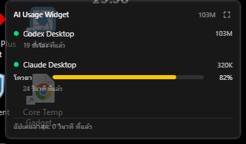
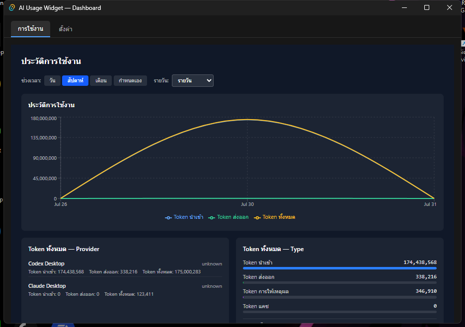
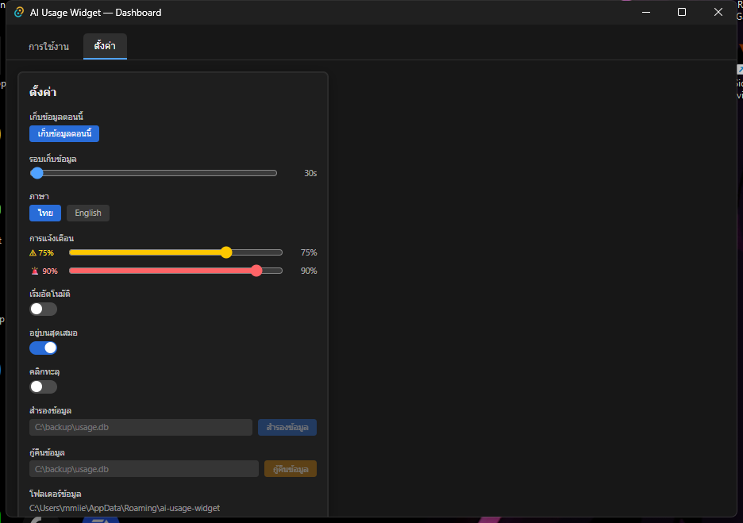

# AI Usage Widget

วิดเจ็ตบน Windows สำหรับดูการใช้ Token และโควตาของ **Codex Desktop** กับ **Claude Desktop** ในหน้าต่างเล็ก ๆ บนหน้าจอ

โปรแกรมอ่านข้อมูลจากไฟล์ที่แอปทั้งสองเก็บไว้ในเครื่อง ไม่ส่ง prompt หรือข้อความสนทนาออกไป และไม่เรียก AI API เพิ่ม จึงไม่ทำให้เสีย Token เพิ่ม

[](https://github.com/teeradetchratchapaiboon/ai-usage-widget/releases/download/v0.1.0/AI-Usage-Widget_0.1.0_x64-setup.exe)

[ดูเวอร์ชันล่าสุด](https://github.com/teeradetchratchapaiboon/ai-usage-widget/releases/latest) · [แจ้งปัญหา](https://github.com/teeradetchratchapaiboon/ai-usage-widget/issues)



## ดาวน์โหลดและติดตั้ง

รองรับ Windows 10 (64-bit) เวอร์ชัน 1803 ขึ้นไป และ Windows 11

1. ดาวน์โหลด [`AI-Usage-Widget_0.1.0_x64-setup.exe`](https://github.com/teeradetchratchapaiboon/ai-usage-widget/releases/download/v0.1.0/AI-Usage-Widget_0.1.0_x64-setup.exe)
2. เปิดไฟล์ที่ดาวน์โหลด แล้วทำตามขั้นตอนในตัวติดตั้ง
3. เปิด **AI Usage Widget** จาก Start Menu
4. โปรแกรมจะแสดงวิดเจ็ตและเริ่มอ่านข้อมูลจาก Codex/Claude ในเครื่องโดยอัตโนมัติ

> ดาวน์โหลดจากหน้า [Releases ของ repository นี้](https://github.com/teeradetchratchapaiboon/ai-usage-widget/releases) เท่านั้น ตัวโปรแกรมสำหรับผู้ใช้คือไฟล์ที่ลงท้ายด้วย `-setup.exe` ส่วน `Source code` ที่ GitHub แสดงให้อัตโนมัติมีไว้สำหรับนักพัฒนา

ไฟล์ติดตั้ง `v0.1.0` ที่เผยแพร่บน GitHub มี SHA-256:

```text
e79b92062fbcc3184c21f286f306abaeac033af7f82c326a693911617209a079
```

Windows 11 มี Microsoft Edge WebView2 Runtime มาให้แล้ว หาก Windows 10 เปิดโปรแกรมไม่ได้ ให้ติดตั้ง [WebView2 Runtime จาก Microsoft](https://developer.microsoft.com/microsoft-edge/webview2/)

## โปรแกรมทำอะไรได้บ้าง

- แสดง Token ที่ใช้วันนี้ แยก Codex Desktop และ Claude Desktop
- แสดงโควตาคงเหลือของรอบ 5 ชั่วโมงและรายสัปดาห์ เมื่อแอปต้นทางมีข้อมูลให้
- บอกอายุของข้อมูล เพื่อไม่ให้ค่าที่เก่าแล้วดูเหมือนข้อมูลปัจจุบัน
- แสดงประวัติการใช้งานแบบรายชั่วโมง รายวัน รายสัปดาห์ และรายเดือน
- แจ้งเตือนเมื่อการใช้งานถึงเกณฑ์ที่กำหนด โดยไม่แจ้งเตือนจากข้อมูลที่เก่าเกินไป
- พับวิดเจ็ต ซ่อนไว้ใน System Tray เปิดโหมดคลิกทะลุ และซ่อนอัตโนมัติเมื่อมีแอปเต็มจอ
- รองรับภาษาไทยและอังกฤษ
- สำรองและกู้คืนฐานข้อมูลการใช้งานได้จากหน้า Settings

## วิธีใช้งาน

### เริ่มต้นครั้งแรก

1. เปิด Codex Desktop หรือ Claude Desktop และใช้งานตามปกติอย่างน้อยหนึ่งครั้ง เพื่อให้แอปต้นทางสร้างข้อมูล
2. เปิด AI Usage Widget โปรแกรมจะเก็บข้อมูลใหม่เป็นระยะโดยอัตโนมัติ
3. หากยังขึ้นว่า **ไม่มีข้อมูล** ให้คลิกขวาที่ไอคอนใน System Tray แล้วเลือก **เก็บข้อมูลตอนนี้**
4. กดปุ่มมุมขวาบนของวิดเจ็ตเพื่อเปิด Dashboard และดูข้อมูลย้อนหลัง

> ปุ่ม **เก็บข้อมูลตอนนี้** สั่งให้อ่านไฟล์ในเครื่องอีกครั้ง ไม่ได้ร้องขอโควตาใหม่จาก Codex หรือ Claude หากแอปต้นทางยังไม่ได้เขียนข้อมูลใหม่ ค่าที่แสดงจะยังไม่เปลี่ยน

### ปุ่มบนวิดเจ็ต

| ปุ่ม | การทำงาน |
| --- | --- |
| `⌃` / `⌄` | พับหรือกางวิดเจ็ต |
| `⤓` | ซ่อนวิดเจ็ตลง System Tray โดยโปรแกรมยังทำงานอยู่ |
| `⛶` | เปิด Dashboard สำหรับดูโควตาปัจจุบันและกราฟย้อนหลัง |

### เมนู System Tray

คลิกขวาที่ไอคอน AI Usage Widget บริเวณมุมขวาล่างของ Windows เพื่อ:

- แสดงวิดเจ็ตที่ซ่อนอยู่
- เปิด Dashboard หรือ Settings
- เก็บข้อมูลทันที
- เปลี่ยนภาษาไทย/อังกฤษ
- ออกจากโปรแกรม

### Click-through

เปิด **คลิกทะลุ** ใน Settings เมื่อต้องการวางวิดเจ็ตเหนือโปรแกรมอื่นโดยไม่บังการคลิกเมาส์ กด `Win + Shift + U` เพื่อกลับมาคลิกวิดเจ็ตได้อีกครั้ง

### การตั้งค่าที่แนะนำ

- **เริ่มอัตโนมัติ** — เปิดโปรแกรมพร้อม Windows
- **อยู่บนสุดเสมอ** — ให้เห็นวิดเจ็ตเหนือหน้าต่างอื่น
- **แจ้งเตือน** — ปรับระดับ Warning และ Critical ได้ตามต้องการ
- **รอบเก็บข้อมูล** — ค่าเริ่มต้น 30 วินาทีเหมาะกับการใช้งานทั่วไป
- **สำรองข้อมูล** — ระบุปลายทางไฟล์แล้วกดสำรองข้อมูลก่อนย้ายเครื่องหรือเปลี่ยนแปลงสำคัญ

## เข้าใจตัวเลขที่แสดง

AI Usage Widget อ่านค่าที่ Codex/Claude เพิ่งเขียนลงดิสก์ จึงไม่ใช่ตัวเลข real-time จาก API

| สถานะ | ความหมาย |
| --- | --- |
| สด | ข้อมูลมีอายุไม่เกิน 15 นาที |
| ล่าสุด | ข้อมูลมีอายุ 15 นาทีถึง 6 ชั่วโมง และจะแสดงอายุไว้ด้วย |
| ข้อมูลเก่า | ข้อมูลเกิน 6 ชั่วโมง ค่าจะจางลงและไม่ใช้แจ้งเตือน |
| รอบหมดแล้ว | เลยเวลารีเซ็ตของรอบเดิม โปรแกรมจะแสดง `—` จนพบข้อมูลใหม่ |

เวลาที่มีเครื่องหมาย `~` เป็นเวลาประมาณจากประวัติ ส่วนเวลาที่ไม่มีเครื่องหมายนี้มาจากข้อมูลที่ provider รายงาน

## หน้าจอโปรแกรม

### Dashboard



ดูโควตาปัจจุบัน สรุป Token แยก provider/model และกราฟย้อนหลัง โดยเลือกช่วงวัน สัปดาห์ เดือน หรือกำหนดช่วงเวลาเองได้

### Settings



ตั้งค่ารอบเก็บข้อมูล ภาษา การแจ้งเตือน Autostart, Always on Top, Click-through และ Backup/Restore

## ข้อมูลและความเป็นส่วนตัว

- อ่านข้อมูลการใช้งานจากไฟล์ของ Codex Desktop และ Claude Desktop ในเครื่อง
- ไม่เก็บ prompt, response หรือเนื้อหาการสนทนา
- ไม่เรียก OpenAI/Anthropic API และไม่สร้าง AI inference request
- เก็บประวัติไว้ในฐานข้อมูล SQLite บนเครื่องของผู้ใช้
- hash project path, session ID และ organization ID ก่อนบันทึก
- เชื่อมต่อ GitHub API เพื่อเช็กเวอร์ชันใหม่เท่านั้น

ข้อมูลต้นทางที่รองรับ:

- Codex: `%USERPROFILE%\.codex\sessions\` และ `%USERPROFILE%\.codex\state_5.sqlite`
- Claude จาก Microsoft Store: ข้อมูลภายใต้ `%LOCALAPPDATA%\Packages\Claude_pzs8sxrjxfjjc\`

ตำแหน่งเก็บข้อมูลจริงของโปรแกรมดูได้ใน **Settings → Data directory**

## แก้ปัญหาเบื้องต้น

### เปิดโปรแกรมแล้วไม่เห็นวิดเจ็ต

- ตรวจไอคอนใน System Tray แล้วเลือก **แสดงวิดเจ็ต**
- ออกจากแอปหรือวิดีโอที่เปิดเต็มจอ เพราะวิดเจ็ตจะซ่อนอัตโนมัติ
- กด `Win + Shift + U` หากเปิด Click-through อยู่

### ไม่พบข้อมูล Codex

- เปิด Codex Desktop และใช้งานอย่างน้อยหนึ่งครั้ง
- ตรวจว่ามีโฟลเดอร์ `%USERPROFILE%\.codex\sessions\`
- เลือก **เก็บข้อมูลตอนนี้** จาก System Tray

### ไม่พบข้อมูล Claude

- เปิด Claude Desktop และใช้งานอย่างน้อยหนึ่งครั้ง
- รุ่นปัจจุบันรองรับตำแหน่งข้อมูลของ Claude ที่ติดตั้งจาก Microsoft Store
- หากติดตั้ง Claude ด้วยวิธีอื่น ตำแหน่งข้อมูลอาจต่างออกไปและยังต้องตั้งค่าเพิ่มเติม

### Windows 10 เปิดโปรแกรมไม่ได้

ติดตั้ง [Microsoft Edge WebView2 Runtime](https://developer.microsoft.com/microsoft-edge/webview2/) แล้วลองเปิดใหม่

หากยังแก้ไม่ได้ ให้เปิด [GitHub Issue](https://github.com/teeradetchratchapaiboon/ai-usage-widget/issues) พร้อมระบุ Windows version, เวอร์ชันโปรแกรม, อาการที่พบ และภาพหน้าจอ โดยไม่แนบไฟล์ session หรือข้อมูลสนทนาส่วนตัว

## ถอนการติดตั้ง

ไปที่ **Windows Settings → Apps → Installed apps → AI Usage Widget → Uninstall**

หากต้องการเก็บประวัติไว้ ให้สำรองข้อมูลจาก Settings ก่อนถอนการติดตั้ง

<details>
<summary><strong>สำหรับนักพัฒนา: Build จาก Source</strong></summary>

### Prerequisites

- Node.js 22
- Rust stable
- Visual Studio Build Tools 2022 พร้อม Desktop development with C++
- Microsoft Edge WebView2 Runtime

### คำสั่ง

```powershell
git clone https://github.com/teeradetchratchapaiboon/ai-usage-widget.git
cd ai-usage-widget
npm ci
npm test
npx tsc --noEmit
npm run tauri build -- --bundles nsis
```

หาก source path มีช่องว่างและ Rust build มีปัญหา ให้กำหนด `CARGO_TARGET_DIR` เป็น path ที่ไม่มีช่องว่างก่อน build

</details>

## License

MIT — ใช้งาน แก้ไข และแจกจ่ายได้ตามเงื่อนไขของสัญญาอนุญาต
